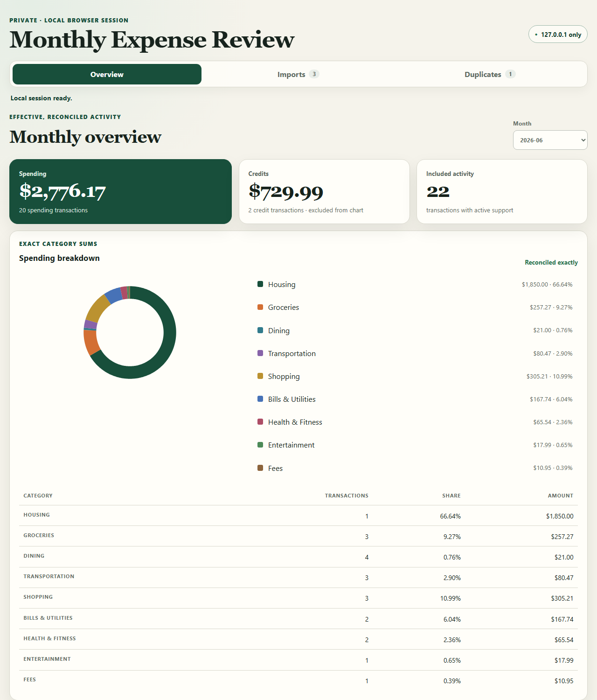

> Part of a controlled A/B comparison: this is the **multi-agent loop** arm (built with the codex-agent-loop-orchestrator skill; the full `docs/loop/` decision ledger is included). See the [solo arm](https://github.com/hanco1/expense-app-solo-session-built) and the [full comparison](https://github.com/hanco1/codex-app-loop-crew/blob/main/COMPARISON.md).





> Reproducibility: this arm's full "conversation" is the inter-agent ledger under [`docs/loop/messages/`](docs/loop/messages) and [`docs/loop/loop-run-log.md`](docs/loop/loop-run-log.md); the requirements it was given are in [`docs/loop/goal.md`](docs/loop/goal.md). How variables were controlled vs the solo build: [VARIABLE-CONTROL.md](VARIABLE-CONTROL.md).

## How to read the "conversation" that built this app

This app was **not** built by one human chatting with one AI. It was built by **four AI agents talking to
each other**, with a human stepping in only at key checkpoints. So there is no single chat log — instead every
message is a small file under [`docs/loop/messages/`](docs/loop/messages). Here is how to read them.

### Who is talking

Each message has a header with `from_lane:` and `to_lane:`. Those two fields tell you who is speaking to whom.
The participants ("lanes") are:

| Lane | Role | Think of it as |
|---|---|---|
| **product** | Breaks the goal into requests, dispatches them, and is the human's proxy | the project manager |
| **data-eng** | Builds the backend (parsing, database, money math) | backend engineer |
| **frontend** | Builds the browser UI (dashboard, pie chart) | frontend engineer |
| **review** | Independently checks each result before it is accepted | QA / code reviewer |
| **human** | You — reached only at sign-off gates and authorizations | the stakeholder |

### Where the "user input" and the "system output" actually are

The `message_type` and the `from_lane → to_lane` direction are what you asked about:

- **Human input (the "user" side)** — any message with **`to_lane: human`** is the system *asking you*, and the
  human's requirements are in [`docs/loop/goal.md`](docs/loop/goal.md) + [`docs/loop/constraints.md`](docs/loop/constraints.md).
  The human's decisions (a `PASS`, an authorization to keep going) are recorded in the `note` column of
  [`docs/loop/loop-run-log.md`](docs/loop/loop-run-log.md).
- **System/agent output** — every other message (`from_lane` = product / data-eng / frontend / review) is an
  agent's output: a request, a "done", a review verdict, or a blocker.

### Message types (the cheat sheet)

| `message_type` | Meaning |
|---|---|
| `IMPLEMENTATION_REQUEST` | product asks an engineer lane to build something |
| `IMPLEMENTATION_DONE` | an engineer lane reports the work is finished (with commit + evidence) |
| `REVIEW_REQUEST` | "please review this" |
| `REVIEW_DONE` | the reviewer's verdict — `PASS` or findings |
| `FIX_REQUEST` | review (or product) sends it back with required fixes |
| `HUMAN_QA_REQUEST` | **product asks you** to open the app and confirm it works |
| `BLOCKED` | work paused, waiting for a human decision |
| `PRE_IMPLEMENTATION_TEST_REQUEST` | review freezes a failing test *before* the fix is written |

### The 30-second version

If you just want the story, open [`docs/loop/loop-run-log.md`](docs/loop/loop-run-log.md) and read it
top to bottom. It is an append-only timeline — one row per step — and reconstructs the entire build:
which lane did what, when, and why.

### Follow one request end-to-end (a worked example)

The pie chart went through five rounds before it was accepted — a good example of what the loop does that a
single session does not. Open the folder
[`docs/loop/messages/REQ-20260715-091230-frontend/`](docs/loop/messages/REQ-20260715-091230-frontend) and
read these in order:

1. `IMPLEMENTATION_REQUEST-iter-1` — product → frontend: build the monthly dashboard.
2. `IMPLEMENTATION_DONE-iter-1` → `REVIEW_REQUEST` → `FIX_REQUEST-iter-2` → `REVIEW_DONE-iter-2`: built,
   reviewed, one round of fixes, reviewer passes the machine checks.
3. `HUMAN_QA_REQUEST-iter-3` — product → **human**: "open the app and confirm the pie chart." (This is the
   human gate. A single AI session would have stopped at step 2 and called it done.)
4. `BLOCKED-pie-rendering-iter-3` — the human reported the pie chart rendered as coloured stripes. Work pauses.
5. `PRE_IMPLEMENTATION_TEST_REQUEST-iter-4` → `FIX_REQUEST-iter-4` → `IMPLEMENTATION_DONE-iter-4` →
   `BLOCKED-review-tiny-slice-iter-4`: the fix is attempted, but review catches that a *tiny* category slice
   would become invisible — a sibling of the same bug — and blocks again.
6. `FIX_REQUEST-iter-5` → `IMPLEMENTATION_DONE-iter-5` → `REVIEW_DONE-iter-5` (verdict `PASS`): a single
   "minimum-visible-arc" rule fixes the whole class of geometry bugs, and it is finally accepted.

That five-round trail — machine-green at step 2, but two real visual bugs only caught by the human and the
independent reviewer afterwards — is exactly the difference the [comparison](https://github.com/hanco1/codex-app-loop-crew/blob/main/COMPARISON.md)
measures against the solo build.

## Start the local web app

Create a local data directory, then run the loopback-only server from the repository root:

```powershell
New-Item -ItemType Directory -Force local-data
python -m frontend.server --database .\local-data\expenses.sqlite
```

Open the exact URL printed after startup (by default, `http://127.0.0.1:8766`). The database is created at the explicit path you provide, and the server listens only on `127.0.0.1`. If the requested port is occupied, startup exits non-zero without printing a success URL or silently choosing another port. `--port 0` remains available for an ephemeral port, and the printed URL contains the actual allocated port. Stop the process with Ctrl+C.

The MVP accepts TD-style CSV and text-based PDF statements. Scanned PDFs and OCR are not supported yet. Financial data stays in the local process and database.

Run the deterministic frontend and real-browser checks with:

```powershell
python -m unittest discover -s tests/frontend -p "test_*.py" -v
python -m unittest tests.frontend.test_browser_e2e -v
```
